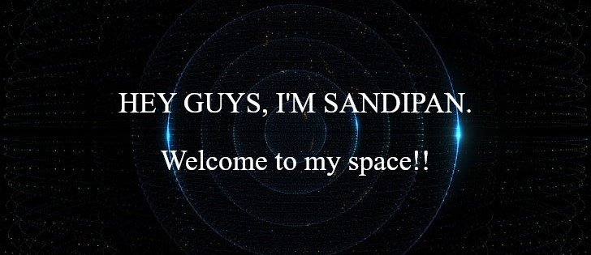

<h2 align="center">About Me</h2>
<ul>
  <li>
🌱 I’m currently learning <strong>Bootstrap</strong> and <strong>Node.js</strong>
</li>
  <li>
💬 Ask me about <strong>JavaScript, CSS and Cpp</strong>
</li>
  <li>
⚡ Fun fact: I'm <strong>addicted</strong> to <strong>F.R.I.E.N.D.S❤</strong> and <strong>☕
</li>
</ul>

<h2 align="center">Languages and Tools</h2>

  
😘 Quick tip-1

  <h4>&nbsp;&nbsp;&nbsp;&nbsp;&nbsp;&nbsp;&nbsp;&nbsp;✨You don't need to climb the entire staircase. Just take that first step.✨</h4>

    
  

  
😘 Quick tip-2

  <h4>&nbsp;&nbsp;&nbsp;&nbsp;&nbsp;&nbsp;&nbsp;&nbsp;✨Do something today that your future self will thank you for.✨</h4>

<h2 align="center">Connect with me</h2>

