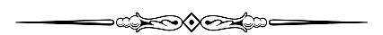

<h2 align="center">< Hey there. Welcome!!  /></h2>

  &nbsp;&nbsp;&nbsp;
  &nbsp;&nbsp;&nbsp;
  &nbsp;&nbsp;&nbsp;
  &nbsp;&nbsp;&nbsp;
  &nbsp;&nbsp;&nbsp;
  &nbsp;&nbsp;&nbsp;
  &nbsp;&nbsp;&nbsp;
  &nbsp;&nbsp;&nbsp;

 

 

Hi, I'm [Sandipan Das](https://sandipan-2224.web.app/), an aspiring **Web Developer** 🚀 from West Bengal, India. Currently, I'm a Project Contributor  🙍🏽‍♂️ [@AOS2020](https://aos.sanscript.tech/), Web Developer 🙍🏽‍♂️[@The-Project-Team](https://www.theprojectteam.in/) and a Former WebDev Intern at [@SparksFoundation](https://www.thesparksfoundationsingapore.org/). Besides coding almost on a daily basis, I also enjoy stealing memes😂 and scourging youtube.🔥

  

**About Me** 👨‍🎓 

- 👨🏽‍💻 I’m currently working on my *personal blog site*
- 🌱 I’m currently learning *MongoDB* and *Mongoose*
- 💬 Ask me about *JavaScript*, *Bootstrap* and *Node.js*
- 📫 How to reach me: [@sandipan0164](https://linkedin.com/sandipan0164/)
- 📝 [My Resume](https://resume.io/r/EWFouhDzC)

**Languages and Tools** 🎨 

  
  
  
  
  
  
  
  
  
  
  
  
 

**You can find my portfolio website here** :heart:

[https://sandipan-2224.web.app/](https://sandipan-2224.web.app/)

  
<strong>My Recent GitHub Activity</strong>

  
<!--START_SECTION:activity-->
1. 🗣 Commented on [#5](https://github.com/Codextream/CGPA_ESTIMATOR/issues/5) in [Codextream/CGPA_ESTIMATOR](https://github.com/Codextream/CGPA_ESTIMATOR)
2. 🎉 Merged PR [#1](https://github.com/sandip2224/Portfolio-Custom-Domain/pull/1) in [sandip2224/Portfolio-Custom-Domain](https://github.com/sandip2224/Portfolio-Custom-Domain)
3. ❗️ Opened issue [#7](https://github.com/sandip2224/Best-Web-Development-Resources/issues/7) in [sandip2224/Best-Web-Development-Resources](https://github.com/sandip2224/Best-Web-Development-Resources)
4. 🎉 Merged PR [#6](https://github.com/sandip2224/Best-Web-Development-Resources/pull/6) in [sandip2224/Best-Web-Development-Resources](https://github.com/sandip2224/Best-Web-Development-Resources)
5. ❗️ Opened issue [#1](https://github.com/sandip2224/Node.js-Authentication/issues/1) in [sandip2224/Node.js-Authentication](https://github.com/sandip2224/Node.js-Authentication)
<!--END_SECTION:activity-->

 

|  |  |
|:------------:|:------------:|

